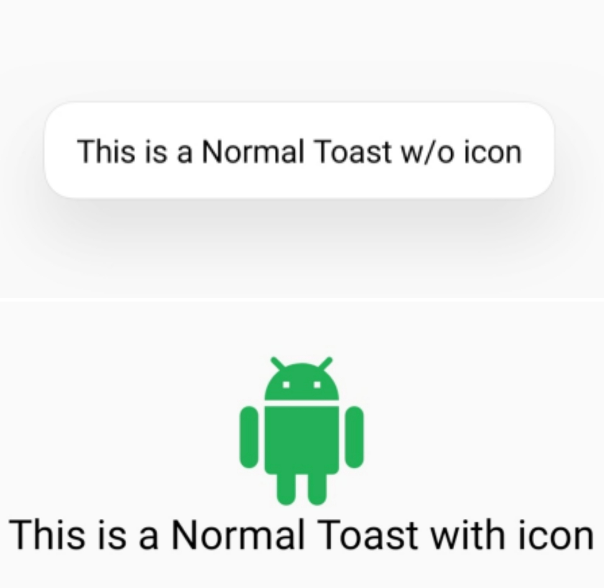
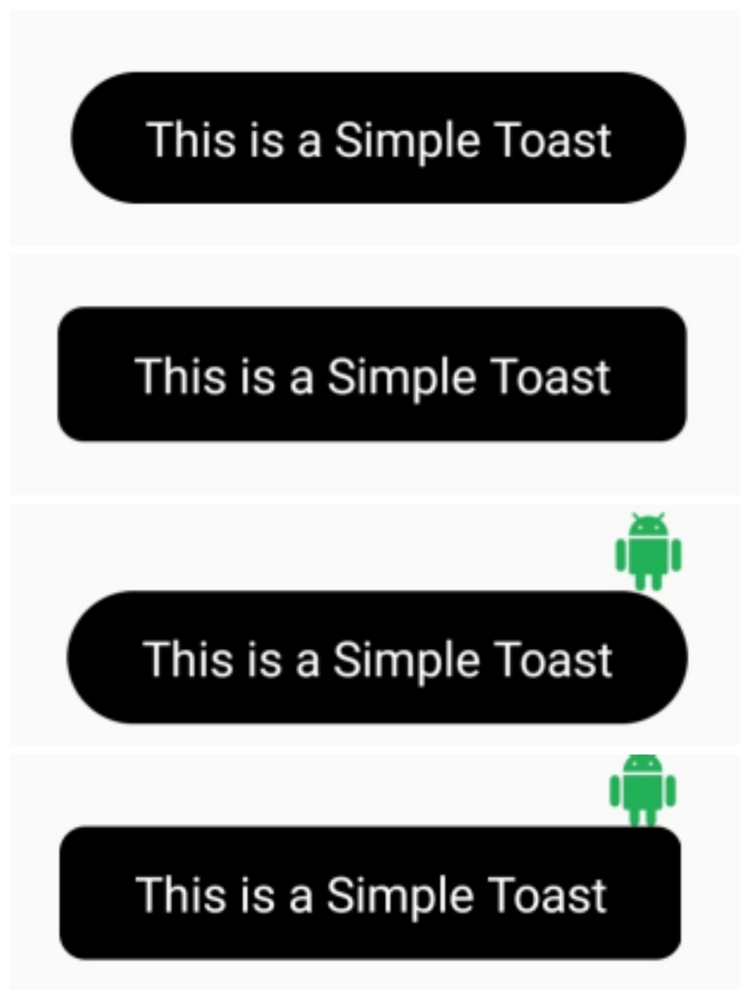
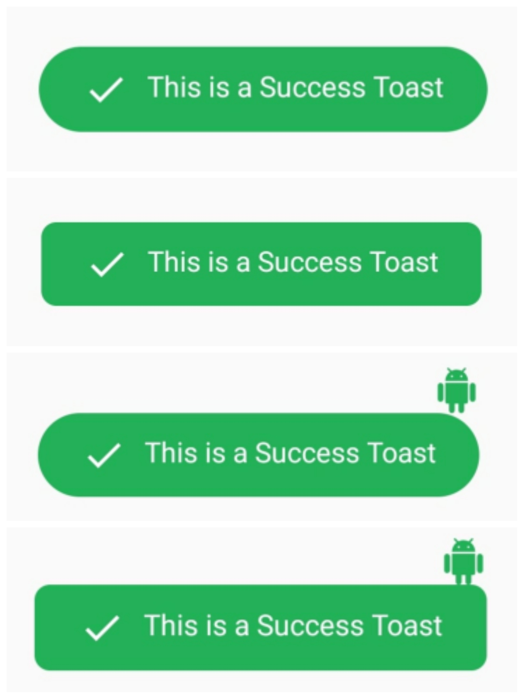
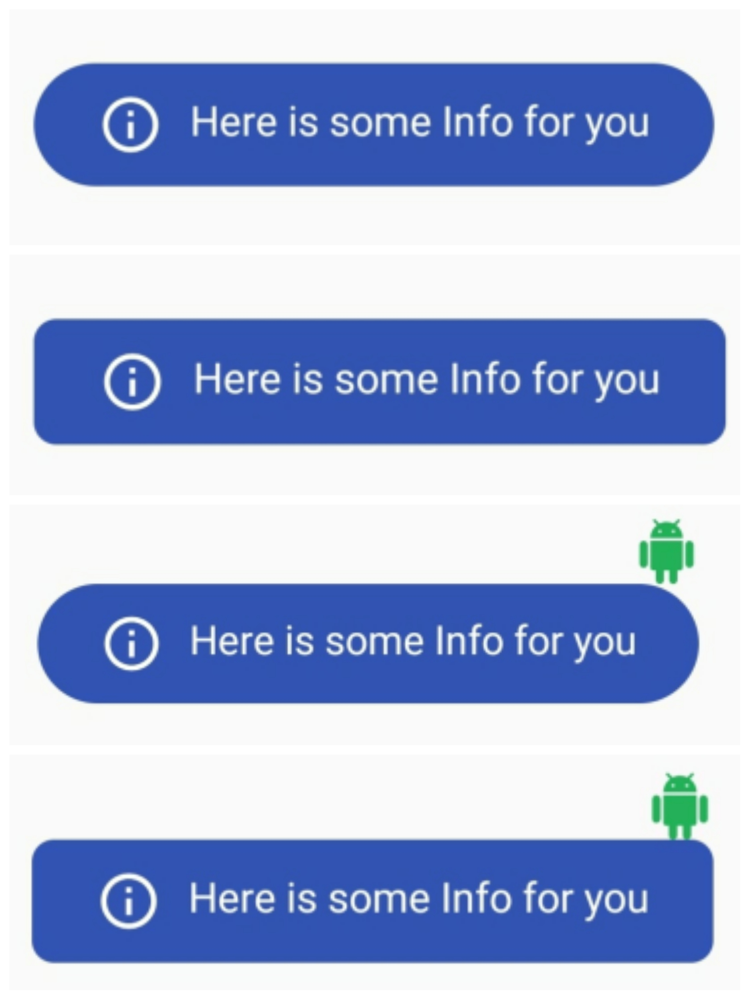
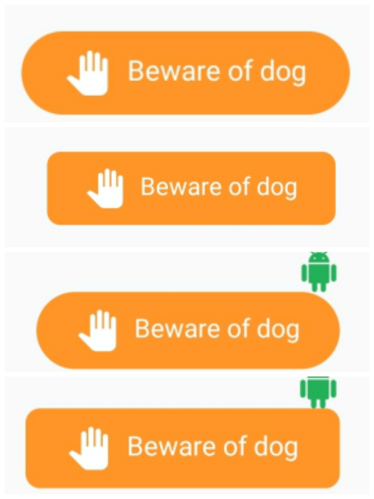
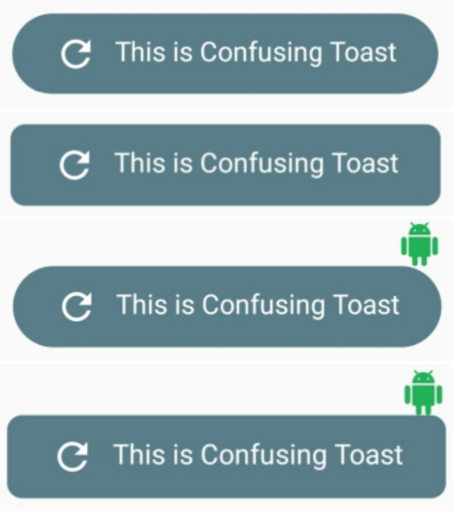
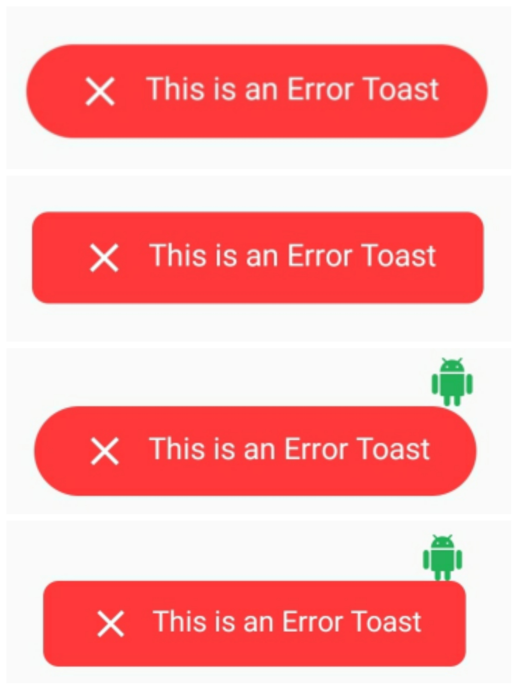

# 😋TastyToast 🍞 for Android 📱

📱 Android Library to implement Rich, Beautiful Toasts for your project with all Guidelines. Easy to use.

<a name="introduction"></a>
## Introduction
**TastyToast** library is built to implement fancy toasts in any Android app. This API will be useful to create rich, animated, beautiful Toasts in Android app easily. 

<a name="requirements"></a>
## Requirements
- AndroidX
- Minimum SDK API 19

<a name="implementation"></a>
## Implementation
Implementation of TastyToast 😋 library is so easy. You can check [/app](/app) directory for demo. Let's have look on basic steps of implementation.
In this demo, we will populate the menu contents by a menu resource file.
<a name="prerequisite"></a>
### Prerequisite
#### Gradle
In `build.gradle` of app module, include these dependencies.
```groovy
dependencies 
{
    // TastyToast library
    implementation 'dev.atharvakulkarni:TastyToast:1.1'
}
```

## Usage

All the programmatic way of implementation of TastyToast library is here.

<table style="width:100%">
  <tr>
    <th>Toast type</th>
    <th>Code</th> 
    <th>Preview</th>
  </tr>
  <tr>
    <td>Normal</td>
    <td>TastyToast.normal(this,"This is a Normal Toast w/o icon",TastyToast.LENGTH_LONG); <BR><BR> 
         TastyToast.normal(this,"This is a Normal Toast with icon",R.drawable.android, TastyToast.LENGTH_LONG);</td> 
    <td></td>
  </tr>    
  <tr>
    <td>Simple</td>
    <td>TastyToast.simple(this,"This is Simple Toast",TastyToast.LENGTH_LONG, TastyToast.SHAPE_ROUND, false); <BR><BR>
        TastyToast.simple(this,"This is Simple Toast",TastyToast.LENGTH_LONG, TastyToast.SHAPE_RECTANGLE, false); <BR><BR>
        TastyToast.simple(this,"This is Simple Toast",TastyToast.LENGTH_LONG, TastyToast.SHAPE_ROUND, true); <BR><BR>
        TastyToast.simple(this,"This is Simple Toast",TastyToast.LENGTH_LONG, TastyToast.SHAPE_RECTANGLE, true);</td> 
    <td></td>
  </tr>
  <tr>
    <td>Success</td>
    <td>TastyToast.success(this,"This is a Success Toast",TastyToast.LENGTH_LONG, TastyToast.SHAPE_ROUND, false); <BR><BR>
        TastyToast.success(this,"This is a Success Toast",TastyToast.LENGTH_LONG, TastyToast.SHAPE_RECTANGLE, false);  <BR><BR>
        TastyToast.success(this,"This is a Success Toast",TastyToast.LENGTH_LONG, TastyToast.SHAPE_ROUND, true); <BR><BR>
        TastyToast.success(this,"This is a Success Toast",TastyToast.LENGTH_LONG, TastyToast.SHAPE_RECTANGLE, true);</td> 
    <td></td>
  </tr>  
  <tr>
    <td>Info</td>
    <td>TastyToast.info(this,"Here is some Info for you",TastyToast.LENGTH_LONG, TastyToast.SHAPE_ROUND, false); <BR><BR>
        TastyToast.info(this,"Here is some Info for you",TastyToast.LENGTH_LONG, TastyToast.SHAPE_RECTANGLE, false); <BR><BR>
        TastyToast.info(this,"Here is some Info for you",TastyToast.LENGTH_LONG, TastyToast.SHAPE_ROUND, true);  <BR><BR>
        TastyToast.info(this,"Here is some Info for you",TastyToast.LENGTH_LONG, TastyToast.SHAPE_RECTANGLE, true);</td> 
    <td></td>
  </tr>
  <tr>
    <td>Warning</td>
    <td>TastyToast.warning(this,"Beware of dog",TastyToast.LENGTH_LONG, TastyToast.SHAPE_ROUND, false); <BR><BR>
        TastyToast.warning(this,"Beware of dog",TastyToast.LENGTH_LONG, TastyToast.SHAPE_RECTANGLE, false); <BR><BR>
        TastyToast.warning(this,"Beware of dog",TastyToast.LENGTH_LONG, TastyToast.SHAPE_ROUND, true);  <BR><BR>
        TastyToast.warning(this,"Beware of dog",TastyToast.LENGTH_LONG, TastyToast.SHAPE_RECTANGLE, true);</td> 
    <td></td>
  </tr>
  <tr>
    <td>Confusing</td>
    <td>TastyToast.confusing(this,"This is Confusing Toast",TastyToast.LENGTH_LONG, TastyToast.SHAPE_ROUND, false);  <BR><BR>
        TastyToast.confusing(this,"This is Confusing Toast",TastyToast.LENGTH_LONG, TastyToast.SHAPE_RECTANGLE, false);  <BR><BR>
        TastyToast.confusing(this,"This is Confusing Toast",TastyToast.LENGTH_LONG, TastyToast.SHAPE_ROUND, true);  <BR><BR>
        TastyToast.confusing(this,"This is Confusing Toast",TastyToast.LENGTH_LONG, TastyToast.SHAPE_RECTANGLE, true);</td> 
    <td></td>
  </tr>
  <tr>
    <td>Error</td>
    <td>TastyToast.error(this,"This is an Error Toast",TastyToast.LENGTH_LONG, TastyToast.SHAPE_ROUND,false);  <BR><BR>
        TastyToast.error(this,"This is an Error Toast",TastyToast.LENGTH_LONG, TastyToast.SHAPE_RECTANGLE, false);  <BR><BR>
        TastyToast.error(this,"This is an Error Toast",TastyToast.LENGTH_LONG, TastyToast.SHAPE_ROUND, true);  <BR><BR>
        TastyToast.error(this,"This is an Error Toast",TastyToast.LENGTH_LONG, TastyToast.SHAPE_RECTANGLE, true);</td> 
    <td></td>
  </tr>  
</table>

Position of toast can also be set by using the function POSITION as follows :

`TastyToast.success(this,"This is a Success Toast",TastyToast.LENGTH_LONG, TastyToast.SHAPE_ROUND,false).setPosition(POSITION.TOP);`

Different Positions :: <ul>
                        <li>TOP</li>
                        <li>BOTTOM</li>
                        <li>CENTER</li>
                        <li>LEFT</li>
                        <li>RIGHT</li>
                        <li>TOP_LEFT</li>
                        <li>TOP_RIGHT</li>
                        <li>BOTTOM_LEFT</li>
                        <li>BOTTOM_RIGHT</li>
                      </ul>

<a name="contributing"></a>
## Contributing
Please fork this repository and contribute back using pull requests. <BR>
If you like this library, please do share with someone who need it.

Any contributions, large or small, major features, bug fixes, are welcomed and appreciated but will be thoroughly reviewed .

<a name="contact"></a>
### Contact - Lets become friend

<ul>
  <li><a href = "https://kulkarniatharva.github.io/">Portfolio Website </a></li>
  <li><a href = "https://github.com/KulkarniAtharva">Github</a></li>
  <li><a href = "https://www.linkedin.com/in/atharva-kulkarni-146279187/">LinkedIn</a></li>
  <li><a href = "https://www.facebook.com/atharva.kulkarni.96343/">Facebook</a></li>
</ul>

Don't forget to star ⭐ the repo it motivates me to share more open source


<a name="donation"></a>
## Donation
If this project help you reduce time to develop, you can give me a cup of coffee :) or dinner 🍕 🍔 will also do 😜


<a name="license"></a>
## License
Project is published under the GPL-3.0 license. Feel free to clone and modify repo as you want, but don't forget to add reference to authors :)
